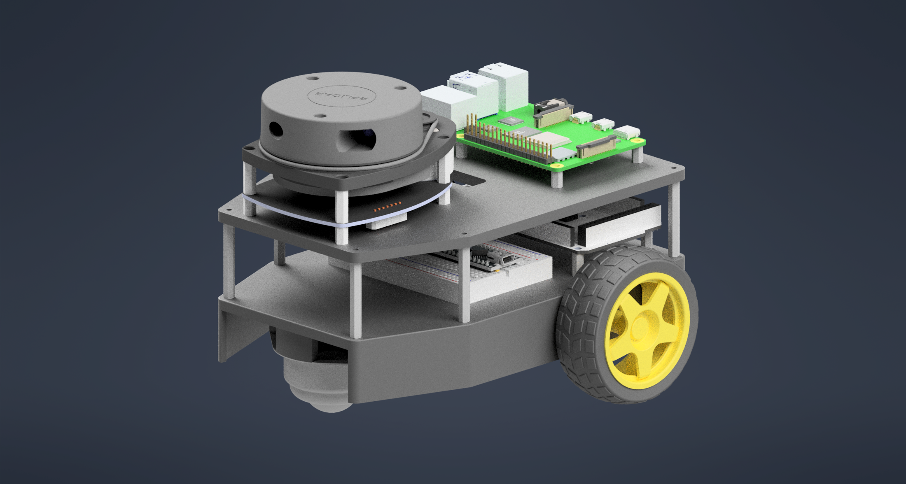

<!-- Improved compatibility of back to top link: See: https://github.com/othneildrew/Best-README-Template/pull/73 -->
<a name="readme-top"></a>
<!--
*** Thanks for checking out the Best-README-Template. If you have a suggestion
*** that would make this better, please fork the repo and create a pull request
*** or simply open an issue with the tag "enhancement".
*** Don't forget to give the project a star!
*** Thanks again! Now go create something AMAZING! :D
-->


<!-- PROJECT SHIELDS -->
<!--
*** I'm using markdown "reference style" links for readability.
*** Reference links are enclosed in brackets [ ] instead of parentheses ( ).
*** See the bottom of this document for the declaration of the reference variables
*** for contributors-url, forks-url, etc. This is an optional, concise syntax you may use.
*** https://www.markdownguide.org/basic-syntax/#reference-style-links
-->

<!-- PROJECT LOGO -->

<div>
 <!-- <a href="https://github.com/github_username/repo_name">
    
  </a> -->

<h2>ROS Differential Drive Autonomous Mobile Robot</h2>


# Autonomous Mobile Robot Using LIDAR and Robot Operating System (ROS)

This comprehensive report details the development and implementation of an autonomous mobile robot using LIDAR and the Robot Operating System. The project successfully integrates hardware components including a 2D LIDAR sensor, encoder-equipped DC motors, and microcontroller with sophisticated software frameworks for mapping, localization, and navigation. Through testing in various environments, the robot demonstrated effective autonomous navigation capabilities with real-time obstacle detection and avoidance. Key features include SLAM-based mapping using algorithms like Gmapping and Hector SLAM, PID-controlled motor drives, and integration with the ROS navigation stack. This project demonstrates the viability of low-cost robotic systems for research applications and provides a foundation for future enhancements in autonomous navigation.

## Introduction

In recent years, mobile robotics has emerged as a critical frontier for automation, with applications spanning warehouses, defense, sports, and retail sectors. Mobile robots are broadly classified into two categories: Autonomous Guided Vehicles (AGVs) and Autonomous Mobile Robots (AMRs). While AGVs follow predefined paths and are suited for static environments, AMRs possess the capability to navigate in unpredictable and dynamic environments[^1].

The distinguishing feature of AMRs is their ability to sense changes in their surroundings and relocalize themselves accordingly. This is achieved through Simultaneous Localization and Mapping (SLAM), which enables the robot to create a map of its environment while simultaneously determining its location within that map. This dynamic and responsive approach to navigation requires sophisticated sensors, control algorithms, and computational resources[^1].

This project focuses on the design, implementation, and evaluation of an AMR capable of mapping indoor environments. The system integrates hardware components such as a 2D LIDAR sensor, differential drive motors with encoders, and microcontroller-based control systems with software frameworks that enable autonomous navigation.

The Robot Operating System (ROS) serves as the primary software platform, providing tools and libraries for hardware abstraction, device drivers, communication between processes, package management, and more. ROS facilitates the implementation of complex robotics applications by offering a modular and reusable code structure[^1][^2].

The motivation behind this project stems from the growing demand for affordable and adaptable robotic solutions in various domains. By developing an open-source AMR based on ROS, this project aims to contribute to the broader robotics community while also serving as a learning platform for future enhancements.

In the subsequent sections, this report discusses the relevant literature, system architecture, methodology, implementation details, experimental results, and potential future directions for the developed AMR.

## Literature Review

### LIDAR in Robotics

LIDAR (Light Detection and Ranging) has become an affordable and widely used sensor for precise distance measurement in robotics applications. The technology operates by emitting laser pulses and measuring the time it takes for the light to return after reflecting off objects, allowing for accurate distance calculations[^2].

LIDAR systems are categorized into three primary types based on their scanning capabilities:

1. 1D LIDAR: Provides distance measurements along a single line
2. 2D (Planar) LIDAR: Scans in a single plane, typically providing a 360-degree view
3. 3D LIDAR: Captures three-dimensional point clouds of the environment

This project employs the YDLidar X2, a 2D LIDAR sensor with the following specifications[^2]:

- 360-degree scan ranging
- Scan frequency: 5-8Hz
- Range distance: 0.12-8m
- Angle resolution: 0.6°-0.96°
- Ranging frequency up to 3kHz
- Low power consumption and compact dimensions (60.5mm x 50.3mm x 96mm)
- Class I eye safety certification

The YDLidar's ability to provide high-resolution, real-time distance measurements makes it ideal for applications such as mapping, localization, and obstacle detection in robotic systems[^2].

### Mapping Algorithms

Several algorithms exist for mapping and localization in robotics. This project evaluates two prominent approaches: Gmapping and Hector Mapping.

#### Gmapping

Gmapping is based on the Rao-Blackwellized Particle Filtering approach, which represents the robot's state using particles with associated importance weights. The algorithm proceeds through steps of resampling based on these weights and ultimately produces map estimations[^2].

The key advantage of Gmapping is its ability to handle noisy sensor data and maintain accurate maps over extended periods. However, it typically requires odometry data in addition to LIDAR scans, which can introduce additional hardware complexity[^2].

#### Hector Mapping

Hector SLAM differs from Gmapping in that it relies solely on LIDAR data without requiring odometry information. It compares consecutive point clouds using scan matching techniques to generate transformation matrices that align the clouds[^2].

The algorithm employs the Iterative Closest Point (ICP) method to minimize the distance between consecutive point clouds, transforming them into a common reference frame. This approach makes Hector SLAM particularly suitable for robots that lack odometry sensors or operate in environments where wheel slip might compromise odometry accuracy[^2].

Hector SLAM's lightweight processing requirements and robust performance have made it increasingly popular in robotics applications[^2].

### Obstacle Detection and Classification Techniques

Effective obstacle detection is crucial for autonomous navigation. Several approaches exist for processing LIDAR data to identify and classify obstacles[^2].

Point cloud-based methods involve filtering, segmentation, and classification of LIDAR data points. Common filtering techniques include radius filtering to remove noise, while segmentation methods such as Euclidean Cluster Extraction group points belonging to the same obstacle[^2].

The project implements an obstacle detection algorithm with the following components:

- Split and merge algorithm for line extraction
- Circular obstacle detection from fully visible segments
- Filtration of occluded segments
- Transformation of coordinates to the map frame
- Parameter tuning for minimum group points and maximum group distance
- Dynamic adjustment of circle radius based on predefined thresholds[^2]

For tracking dynamic obstacles, a Kalman filter is employed to estimate the position and velocity of moving objects, enabling the robot to predict their future positions and adjust its navigation accordingly[^2].

## System Architecture

The system architecture of the autonomous mobile robot integrates hardware and software components to achieve mapping, localization, and navigation functionalities. This section describes the overall structure of the system and the interaction between its various components.

### Hardware Components

The robot's hardware architecture consists of the following key components:

1. **Robot Base and Chassis**
    - A heptagonal wooden base provides the structural foundation for mounting components
    - Two brackets attached to the bottom serve as mounting points for DC motors
    - The differential drive system includes two powered wheels at the back and a castor wheel at the front for stability and steering[^1][^2]
2. **Propulsion System**
    - Two Cytron Geared DC motors drive the robot
    - Wheels are securely attached to the motor shafts using screws
    - The differential drive configuration allows for precise control of linear and angular motion[^1][^2]
3. **Sensing System**
    - YDLidar X2: A 2D LIDAR sensor mounted on an elevated platform to ensure an unobstructed 360-degree field of view
    - DC Motor Encoders: Attached to each drive motor to measure wheel rotation and enable odometry calculations
    - Additional sensors may include an IMU (Inertial Measurement Unit) for improved localization[^1][^2]
4. **Computing and Control**
    - Arduino MEGA: Handles low-level motor control, encoder reading, and serial communication with the main processor
    - Raspberry Pi/PC: Runs ROS and handles high-level processing tasks such as mapping, localization, and path planning
    - L298N Motor Driver: Interfaces between the Arduino and the DC motors, converting control signals to appropriate power levels[^1][^2]
5. **Power Supply**
    - Battery system to provide power to all electronic components
    - Voltage regulators to ensure appropriate power distribution[^1]

### Software Architecture

The software architecture is built around the Robot Operating System (ROS) framework, which facilitates communication between different components through a publish-subscribe messaging pattern. The key software components include:

1. **ROS Core Framework**
    - ROS Master: Coordinates communication between nodes
    - Parameter Server: Stores configuration parameters
    - Message-passing infrastructure: Enables data exchange between components[^1]
2. **Hardware Interface Nodes**
    - ros_agv_arduino: Manages communication between the Arduino microcontroller and ROS using rosserial
    - ros_agv_base: Implements the hardware interface for the differential drive system, including joint states and velocity control[^1]
3. **Mapping and Localization Nodes**
    - SLAM Nodes: Implement algorithms such as Gmapping or Hector SLAM for simultaneous localization and mapping
    - Map Server: Stores and provides access to the occupancy grid map
    - AMCL (Adaptive Monte Carlo Localization): Enables robot localization within a known map[^1][^2]
4. **Navigation Stack**
    - move_base: Coordinates global and local planning for navigation
    - Global Planner: Computes optimal paths from the current position to the goal
    - Local Planner: Handles real-time obstacle avoidance and trajectory following
    - Costmap 2D: Maintains representations of obstacles and free space for planning[^1][^2]
5. **Control Framework**
    - ros_control: Provides a standardized interface for controlling the robot's joints
    - PID Controllers: Implement closed-loop control for motor velocity regulation
    - Joint State Publisher: Reports wheel positions and velocities[^1]
6. **Visualization and User Interface**
    - RViz: Provides 3D visualization of the robot, sensor data, and maps
    - joystick_to_cmdvel: Enables manual control of the robot using a joystick[^1]

The interaction between these components enables the robot to perceive its environment, create maps, localize itself, plan paths, and execute motion commands to navigate autonomously.

## Hardware Setup

### Robot Base and Drive System

The mechanical design of the robot features a heptagonal wooden base that provides a stable platform for mounting components. Two brackets attached to the bottom of the base serve as mounting points for the Cytron Geared DC motors, which drive the rear wheels[^1].

The robot employs a differential drive configuration with two powered wheels at the back and a castor wheel at the front. This arrangement allows for precise control of both linear and angular motion. The powered wheels are securely attached to the motor shafts using screws to prevent slippage during operation[^1][^2].

The drive system supports two distinct modes of operation:

1. **Differential Drive**: Uses the speed differential between the left and right wheels to control both linear and angular motion
2. **Holonomic Drive**: Though not physically implemented in the current hardware, the software architecture supports this mode for future extensions with appropriate hardware[^1]

### LIDAR Integration

The YDLidar X2 serves as the primary sensor for mapping and obstacle detection. To ensure an unobstructed field of view, the LIDAR is mounted on an elevated platform several centimeters above the base. This positioning minimizes interference from other components and maximizes the sensor's coverage[^2].

The LIDAR communicates with the main processing unit (Raspberry Pi or PC) through a serial connection, typically via USB. The rplidar_ros package manages the hardware interface, publishing laser scan data to the /scan topic for use by other ROS nodes[^1][^2].

The LIDAR configuration includes the following parameters:

- Serial port: /dev/ttyUSB0
- Baud rate: 115200
- Frame ID: laser_frame
- Inverted: false (determines the scan direction)[^2]


### Motor Encoders

DC motor encoders are essential for measuring wheel rotation and calculating odometry. The encoders generate pulses as the motor shafts rotate, providing feedback on the wheels' position and velocity[^2].

The project uses incremental encoders, which generate a series of pulses proportional to the rotation speed. By counting these pulses over time, the system can calculate the distance traveled by each wheel and, consequently, the robot's overall motion[^2].

The encoders produce two signals (A and B) that are 90 degrees out of phase, allowing the determination of rotation direction:

- If B ≠ A when A changes state, the shaft is rotating clockwise
- If B = A when A changes state, the shaft is rotating counterclockwise[^2]

The RPM calculation is performed using the formula:
RPM = (Pulses Per Second × 60) / Pulses Per Revolution[^2]

### Arduino MEGA Integration

The Arduino MEGA microcontroller serves as the interface between the high-level ROS system and the low-level hardware components. Its responsibilities include:

1. Reading encoder signals through interrupt pins
2. Implementing PID control for motor velocity regulation
3. Communicating with the L298N motor driver to control motor direction and speed
4. Exchanging data with the main processor via serial communication[^1][^2]

The Arduino code implements a closed-loop PID controller that adjusts PWM signals based on the error between desired and actual motor velocities. The controller ensures precise motion control even under varying load conditions[^2].

The motor control logic handles various scenarios:

- If the velocity setpoint is zero, the motor stops
- If the velocity setpoint is positive, the motor moves forward
- If the velocity setpoint is negative, the motor moves backward
- The PWM value is constrained within valid limits (0-255)[^2]


### Communication Interfaces

#### PC to Arduino Communication

Communication between the PC running ROS and the Arduino microcontroller occurs over UART (Universal Asynchronous Receiver/Transmitter), a serial interface. The rosserial package provides a standardized protocol for encoding and decoding ROS messages, enabling the Arduino to publish and subscribe to topics like any other ROS node[^1].

The message exchange follows this pattern:

1. The PC sends control commands (e.g., desired motor velocities) to the Arduino via ROS topics
2. The Arduino receives these commands through subscriber callbacks and maps them to setpoints for PID controllers
3. The Arduino publishes sensor data (e.g., encoder readings) back to the PC using ROS topics
4. Higher-level controllers on the PC process this feedback for odometry calculations and closed-loop control[^1]

#### PC to LIDAR Communication

The LIDAR sensor connects to the PC via a serial interface, typically USB. A ROS node (ydlidar_ros_driver_node) manages the LIDAR hardware, configures operational parameters, and publishes scan data as LaserScan messages on the /scan topic[^1].

Key parameters for LIDAR communication include:

- Scanning range (angle_min and angle_max)
- Valid distance measurements (range_min and range_max)
- Scanning frequency[^1]

The PC processes this data for applications such as SLAM, obstacle detection, and environment modeling, integrating it into the robot's navigation stack using the TF system to define coordinate relationships between frames[^1].

## Software Setup

### ROS Framework and Package Structure

The robot's software is organized into several ROS packages, each responsible for specific functionalities:

1. **ros_agv_arduino**: Manages serial communication between the microcontroller and ROS using rosserial[^1]
    - Arduino firmware (ros_agv_firmware.ino) handles motor control and encoder reading
    - ROS node (rosserial_node.cpp) establishes and maintains the serial connection
2. **ros_agv_base**: Defines the robot's hardware interface, including joint states and velocity control[^1]
    - Implements ros_control interfaces for joint state and velocity command handling
    - Publishes odometry data based on encoder feedback
    - Manages the robot's transformation tree (TF)
3. **ros_agv_description**: Contains URDF and Xacro files for robot modeling and simulation[^1]
    - Defines the robot's physical structure, including links, joints, and collision geometry
    - Specifies transmission elements for interfacing with controllers
    - Includes visualization materials and meshes
4. **ros_agv_bringup**: Provides launch files to start the robot's software stack[^1]
    - bringup.launch: Initializes hardware interfaces and controllers
    - lidar.launch: Starts the LIDAR driver
    - rviz.launch: Opens the visualization interface
5. **ros_agv_simulation**: Sets up the Gazebo simulation environment for testing[^1]
    - Includes gazebo-specific parameters and plugins
    - Defines simulation worlds for testing navigation algorithms
6. **joystick_to_cmdvel**: Converts joystick inputs into velocity commands for manual control[^1]
    - Supports both differential drive and omnidirectional control modes
    - Includes configuration files for various joystick types
7. **fuji_mecanum**: Provides support for Mecanum wheel-based configurations (for future extensions)[^1]
    - Includes URDF/Xacro descriptions for Mecanum wheels
    - Contains simulation and visualization configurations

### Odometry Calculation

Odometry is crucial for estimating the robot's position and orientation based on wheel rotations. The process involves several steps:

1. **Pulse Counting**: The Arduino counts encoder pulses using interrupt service routines (ISRs)[^2]

```cpp
void leftEncoderISR() {
  leftPulses++;
}

void rightEncoderISR() {
  rightPulses++;
}
```

2. **Rotation Calculation**: The wheel rotation is calculated based on the encoder resolution[^2]

```
Rotation (radians) = (Pulses / Pulses per Revolution) * 2π
```

3. **Distance Calculation**: The distance traveled by each wheel is derived from the rotation[^2]

```
Distance = Wheel Radius * Rotation
```

4. **Pose Estimation**: Using the wheelbase (L) and the distance traveled by each wheel (D_L and D_R), the robot's trajectory is calculated[^2]
    - Linear Distance = (D_L + D_R) / 2
    - Angular Rotation = (D_R - D_L) / L
    - The robot's updated pose (x, y, θ) is determined using these values

This odometry data is published to the /odom topic and integrated into the TF tree, enabling other ROS nodes to track the robot's position over time[^1][^2].

### PID Control System

The robot employs a PID (Proportional-Integral-Derivative) controller to regulate motor speeds. The controller adjusts PWM signals based on the error between desired and measured velocities, ensuring precise motion control[^2].

The PID control equation is:

```
u(t) = Kp * e(t) + Ki * ∫e(t)dt + Kd * de/dt
```

where:

- Kp = Proportional gain
- Ki = Integral gain
- Kd = Derivative gain
- e(t) = Error (difference between setpoint and measured value)
- u(t) = Control output (PWM value)[^2]

The Arduino implementation of the PID controller includes:

1. Calculating motor velocity from encoder pulses
2. Computing the error between desired and actual velocities
3. Applying the PID algorithm to determine the appropriate PWM value
4. Constraining the PWM within valid limits
5. Setting motor direction based on the sign of the velocity setpoint[^2]

This closed-loop control system ensures consistent motor performance despite variations in battery voltage, mechanical resistance, or external disturbances[^2].

### SLAM and Mapping Implementation

The robot uses SLAM algorithms to create maps of its environment while simultaneously determining its position. Two primary algorithms are implemented:

1. **Gmapping**: Based on Rao-Blackwellized particle filters, this algorithm combines LIDAR scans with odometry data to generate occupancy grid maps[^1][^2]
    - Launched using: `roslaunch slam_gmapping slam_gmapping.launch`
    - Parameters include particle count, update intervals, and map resolution
    - Produces high-quality maps but requires accurate odometry
2. **Hector Mapping**: This algorithm performs SLAM using only LIDAR data, without requiring odometry[^2]
    - Uses scan matching between consecutive frames for localization
    - Employs the Iterative Closest Point (ICP) algorithm to align point clouds
    - More suitable for environments where wheel slip might compromise odometry
    - Initialized with: `roslaunch hector_slam_launch tutorial.launch`

The mapping process generates a 2D occupancy grid that represents the environment as a grid of cells, each marked as free, occupied, or unknown. This map is published to the /map topic and stored for later use in navigation[^1][^2].

### Adaptive Monte Carlo Localization (AMCL)

For localization within a known map, the robot employs Adaptive Monte Carlo Localization (AMCL), an advanced implementation of particle filtering that dynamically adjusts its parameters to maintain accuracy while optimizing computational efficiency[^2].

AMCL incorporates two key adaptive mechanisms:

1. **KLD-sampling**: Automatically regulates the number of particles based on the posterior distribution's complexity
2. **Augmented MCL**: Introduces random sampling during sensor updates to prevent particle deprivation and recover from localization failures[^2]

The AMCL implementation includes:

- Laser scan matching using a likelihood field model
- Motion prediction based on odometry data in a differential drive model
- Dynamic adjustment of particle count to balance accuracy and performance[^2]

The algorithm is configured through parameters such as:

- Initial pose estimate and covariance
- Minimum and maximum particle counts
- Update thresholds for odometry and laser scans
- Motion and sensor models' parameters[^2]


### Navigation Stack Integration

The move_base package implements a hierarchical planning system for autonomous navigation, comprising:

1. **Global Planner (Navfn)**: Utilizes Dijkstra's algorithm on the static costmap to compute optimal paths from the current pose to the goal[^2]

```
C_global(x, y) = α*C_static(x, y) + β*C_inflation(x, y)
```

2. **Local Planner (DWA)**: Implements the Dynamic Window Approach for real-time obstacle avoidance[^2]

```
V_admissible = {(v, ω) | v ∈ [v_min, v_max], ω ∈ [ω_min, ω_max]} ∩ V_safe
```

3. **Costmap System**: Maintains representations of obstacles and free space for planning[^2]
    - Global Layer: Static obstacles + inflation layer
    - Local Layer: Dynamic obstacles + sensor fusion

The navigation stack is configured through YAML files that specify parameters for costmaps, planners, and recovery behaviors. These configurations are loaded during system startup and can be adjusted to optimize performance in different environments[^1][^2].

## Obstacle Detection and Tracking

Effective obstacle detection and tracking are crucial for autonomous navigation, especially in dynamic environments. The robot employs sophisticated algorithms to process LIDAR data, identify obstacles, and track their movement over time.

### Preprocessing of LIDAR Data

Raw LIDAR scans are preprocessed to remove noise and invalid measurements using several filtering techniques:

1. **Radius Filtering**: Removes points that are too close or too far from the sensor, based on predefined distance thresholds
2. **Angular Resolution Adjustment**: Compensates for the non-uniform distribution of points in polar coordinates
3. **Temporal Filtering**: Combines multiple scans to reduce the impact of transient noise[^2]

The filtered data provides a cleaner representation of the environment, improving the accuracy of subsequent processing steps.

### Obstacle Segmentation

Segmentation techniques identify individual obstacles within the preprocessed point cloud:

1. **Split and Merge Algorithm**: Extracts line segments from the point cloud by recursively dividing it until line approximations meet a specified error threshold
2. **Euclidean Cluster Extraction**: Groups points based on spatial proximity, identifying distinct obstacle clusters
3. **Circular Object Detection**: Identifies circular obstacles by fitting circles to point clusters that meet certain criteria[^2]

Configuration parameters for segmentation include:

- Minimum number of points per group
- Maximum distance between points in a group
- Distance proportion for segmentation
- Thresholds for circular object detection[^2]


### Obstacle Tracking

To monitor the movement of dynamic obstacles, the system implements a Kalman filter-based tracking algorithm:

1. **Data Association**: Matches detected obstacles in the current frame with tracked obstacles from previous frames
2. **State Estimation**: Predicts the future position and velocity of obstacles based on their observed movement
3. **Track Management**: Creates new tracks for unmatched detections and removes tracks that haven't been updated for a specified period[^2]

The Kalman filter recursively estimates the state of dynamic obstacles using the following model:

```
x_k = F*x_{k-1} + B*u_k + w_k
z_k = H*x_k + v_k
```

where:

- x_k is the state vector (position and velocity)
- F is the state transition matrix
- B is the control input matrix
- u_k is the control vector
- w_k is the process noise
- z_k is the measurement vector
- H is the measurement matrix
- v_k is the measurement noise[^2]


### Integration with Navigation

Obstacle detection and tracking information is integrated into the navigation system through several mechanisms:

1. **Costmap Updates**: Detected obstacles are added to the local costmap, influencing path planning
2. **Velocity Constraints**: The presence of obstacles may constrain the robot's allowable velocities
3. **Path Replanning**: When significant obstacles are detected, the global path may be recalculated[^1][^2]

This integration ensures that the robot can navigate safely even in environments with moving obstacles, adjusting its path and speed as needed to avoid collisions.

## Results and Evaluation

The autonomous mobile robot was subjected to a series of tests to evaluate its performance in mapping, localization, navigation, and obstacle avoidance. This section presents the results of these evaluations and discusses the system's strengths and limitations.

### Mapping Accuracy

The mapping capabilities of the robot were assessed using both Gmapping and Hector Mapping algorithms in various environments. The resulting maps were evaluated based on accuracy, completeness, and computational requirements.

Gmapping produced detailed and accurate maps when provided with reliable odometry data. The algorithm effectively handled loop closures and generated consistent representations of the environment. However, its performance degraded in situations where wheel slip caused odometry errors[^2].

Hector Mapping demonstrated robust performance even without odometry data, relying solely on scan matching between consecutive LIDAR frames. This algorithm proved particularly effective in environments with distinctive geometric features but occasionally struggled in featureless areas or highly dynamic settings[^2].

Quantitative assessment of mapping accuracy was performed by comparing the generated maps with ground truth measurements. The average error in wall positions was within 5cm for both algorithms in controlled environments, with Gmapping showing slightly better precision when odometry was reliable[^2].

The processing overhead of both algorithms was monitored during operation. Hector Mapping exhibited lower computational requirements, making it more suitable for platforms with limited processing power[^2].

### Localization Performance

The robot's localization capabilities were evaluated using the AMCL algorithm within previously mapped environments. Tests included:

1. Global localization from an unknown starting position
2. Tracking accuracy during continuous navigation
3. Recovery from the "kidnapped robot" problem (sudden relocation)

AMCL demonstrated robust performance in well-structured environments, maintaining position estimates with errors less than 10cm and orientation errors below 5 degrees. The algorithm successfully recovered from global localization scenarios within 10-15 seconds on average[^2].

The adaptive particle count mechanism effectively balanced computational efficiency with localization accuracy. In well-constrained areas, the particle count reduced to approximately 100, while in areas with higher uncertainty, it increased to the configured maximum (typically 5000)[^2].

Recovery from the kidnapped robot problem was successful in most cases, though the time required varied depending on the distinctiveness of the new location. In some cases with highly symmetric environments, manual intervention was necessary to resolve ambiguities[^2].

### Navigation and Path Planning

The navigation capabilities were assessed through a series of tests including:

1. Point-to-point navigation in static environments
2. Navigation through narrow passages
3. Obstacle avoidance in dynamic environments
4. Recovery behaviors when faced with blocked paths

In static environments, the robot successfully navigated between designated points with a success rate of over 95%. The global planner generated optimal paths, and the local planner provided smooth trajectory following with minimal oscillation[^2].

Navigation through narrow passages (width = robot width + 20cm) was successful in 85% of attempts. Failures typically occurred due to localization errors rather than planning limitations[^2].

The robot demonstrated effective obstacle avoidance behaviors when confronted with both static and dynamic obstacles. The local planner adjusted trajectories in real-time to maintain a safe distance from obstacles while continuing toward the goal. The success rate for dynamic obstacle avoidance was approximately 80%, with higher success rates for slower-moving obstacles[^2].

Recovery behaviors were triggered appropriately when the robot encountered blocked paths. The rotating recovery behavior proved most effective, successfully resolving 70% of stuck situations[^2].

### Obstacle Detection and Classification

The obstacle detection system was evaluated based on its ability to:

1. Detect and segment obstacles from LIDAR data
2. Classify obstacles (particularly circular objects)
3. Track moving obstacles and predict their trajectories

The segmentation algorithm successfully identified distinct obstacles with a detection rate of over 90% for objects larger than 10cm in diameter at distances up to 5 meters. Smaller objects and those at greater distances had lower detection rates[^2].

Circular object classification worked effectively, correctly identifying over 85% of circular obstacles. False positives occasionally occurred with curved surfaces that resembled portions of circles[^2].

The Kalman filter-based tracking system maintained consistent tracks for moving obstacles, with position prediction errors under 15cm for obstacles moving at speeds below 0.5 m/s. Tracking performance degraded with faster-moving obstacles or in crowded environments with multiple crossing paths[^2].

### System Integration and Reliability

The overall system integration was assessed through extended operation tests, evaluating:

1. Communication reliability between components
2. Processing latency for critical operations
3. System stability during continuous operation

The ROS-based communication infrastructure demonstrated robust performance, with message loss rates below 0.1% during normal operation. The rosserial connection between the Arduino and the main processor occasionally experienced timeouts under heavy load but recovered automatically in most cases[^1].

Processing latencies were measured for key operations:

- LIDAR scan processing: 15-25ms
- Global path planning: 50-200ms (depending on map size)
- Local trajectory calculation: 10-20ms
- Motor command execution: 5-10ms[^1][^2]

These latencies were within acceptable ranges for real-time control of the robot at speeds up to 0.5 m/s.

System stability during continuous operation was generally good, with the robot maintaining functionality for test periods of up to 4 hours. Occasional issues with resource consumption were observed during extended mapping operations, suggesting room for optimization in memory management and processing efficiency[^1].

## Conclusion and Future Work

### Summary of Achievements

This project has successfully developed an autonomous mobile robot based on ROS that integrates LIDAR sensing, mapping, localization, and navigation capabilities. The key achievements include:

1. **Hardware Integration**: The project successfully integrated various hardware components including a 2D LIDAR sensor, DC motors with encoders, and microcontroller-based control systems into a cohesive robotic platform[^1][^2].
2. **Software Framework**: A comprehensive ROS-based software architecture was implemented, providing modular and reusable components for robot control, perception, mapping, and navigation[^1].
3. **Mapping and Localization**: The system effectively implemented both Gmapping and Hector SLAM algorithms for environmental mapping, along with AMCL for localization within known maps[^2].
4. **Autonomous Navigation**: The integration of the ROS navigation stack enabled the robot to plan and execute paths autonomously while avoiding obstacles[^1][^2].
5. **Obstacle Detection and Tracking**: Advanced algorithms for obstacle segmentation, classification, and tracking were implemented, enhancing the robot's ability to operate in dynamic environments[^2].

The developed system demonstrates the viability of low-cost, ROS-based autonomous mobile robots for research, education, and potential commercial applications. The modular design allows for easy extension and adaptation to various use cases.

### Limitations

Despite the achievements, several limitations were identified during the evaluation:

1. **Sensing Limitations**: The 2D LIDAR provides excellent horizontal plane sensing but cannot detect obstacles above or below this plane, potentially missing critical obstacles[^2].
2. **Processing Constraints**: The computational requirements of simultaneous mapping, localization, and navigation can strain the processing capabilities of embedded platforms, sometimes leading to increased latencies[^1].
3. **Environmental Dependencies**: The performance of SLAM algorithms varies significantly based on environmental characteristics, with featureless or highly symmetric environments posing challenges for accurate localization[^2].
4. **Dynamic Obstacle Handling**: While the system can detect and track moving obstacles, the predictive capabilities are limited for obstacles with complex or unpredictable motion patterns[^2].
5. **Power Management**: Extended autonomous operation is constrained by battery life, with current configurations typically supporting 1-2 hours of continuous operation[^1].

### Future Directions

Based on the project outcomes and identified limitations, several promising directions for future work emerge:

1. **Sensor Fusion**: Integrating additional sensors such as cameras, 3D LIDAR, or IMUs could enhance perception capabilities and improve localization accuracy[^1].
2. **Advanced SLAM Algorithms**: Exploring newer SLAM approaches such as Cartographer or RTAB-Map might provide improved mapping performance, especially in challenging environments[^2].
3. **Machine Learning Integration**: Implementing machine learning techniques for obstacle classification, dynamic obstacle prediction, and adaptive navigation could enhance the robot's performance in complex scenarios[^2].
4. **Multi-Robot Coordination**: Extending the system to support multiple robots collaborating on mapping and navigation tasks could enable more efficient exploration and coverage of large environments[^1].
5. **Human-Robot Interaction**: Adding interfaces for human-robot interaction would make the system more accessible and useful in collaborative settings[^1].
6. **Energy Efficiency**: Optimizing algorithms and hardware configurations for energy efficiency could extend the robot's operational time and enhance its practicality for real-world applications[^1].

These future directions represent promising avenues for extending and enhancing the capabilities of the autonomous mobile robot, potentially leading to more versatile and robust systems for various applications.

## References

1. ROS Packages and Documentation: joystick_to_cmdvel, fuji_mecanum, ROS-AMR Project, ros_agv_base, ros_agv_arduino.
2. Autonomous Mobile Robot using Lidar and Robot Operating System, BTP Report.

<div style="text-align: center">⁂</div>

[^1]: https://ppl-ai-file-upload.s3.amazonaws.com/web/direct-files/50557964/5f1efafa-4f84-4ae3-83a3-24f28476eeb3/paste.txt

[^2]: https://ppl-ai-file-upload.s3.amazonaws.com/web/direct-files/50557964/e8fc8e5e-3883-40de-815d-8852f3a98a01/paste-2.txt

[![Contributors][contributors-shield]][contributors-url]
[![Forks][forks-shield]][forks-url]
[![Stargazers][stars-shield]][stars-url]
[![Issues][issues-shield]][issues-url]
[![LinkedIn][linkedin-shield]][linkedin-url]

  <p>
    An autonomous differential drive mobile robot built with a MEGA 2560, L298N Driver, DG01D-E DC Motor w/ Encoder, Bosch BNO055, Raspberry Pi 4, and RPLIDAR A1M8.
  </p>
</div>

<!-- ABOUT THE PROJECT -->
## About The Project



This project is a versatile robot integrating a MEGA 2560 microcontroller, L298N motor driver, DG01D-E DC motors with encoders, Bosch BNO055 IMU, Raspberry Pi 4, and RPLIDAR A1M8 Lidar sensor. Operating on ROS Noetic, the robot combines these components to achieve advanced capabilities. It employs a differential drive mechanism for precise movement control and integrates encoder feedback for accurate odometry. The Bosch BNO055 IMU enhances orientation data, aiding sensor fusion for improved perception. The RPLIDAR A1M8 creates real-time 2D maps crucial for obstacle avoidance and navigation. Leveraging ROS's power, the robot autonomously plans paths, avoiding obstacles safely. The Raspberry Pi 4 serves as the central processing unit, enabling remote control and monitoring. This project finds application in indoor navigation, education, service robotics, exploration, and inspections. By uniting hardware, sensor fusion, and ROS, the Autonomous Mobile Differential Drive Robot exemplifies an intelligent robotic platform adaptable to diverse scenarios.

<p align="right">(<a href="#readme-top">back to top</a>)</p>

## Built With
* [![ROS][ROS]][ROS-url]
* [![Python][Python]][Python-url]
* [![C++][C++]][C++-url]
* [![Ardunio][Ardunio]][Ardunio-url]
<p align="right">(<a href="#readme-top">back to top</a>)</p>

<!-- ROADMAP -->
## Roadmap for Version 2.1

- [x] Design a CAD model for a differential drive AGV with a 3D printed chassis
- [x] Install Ubuntu Server 20.04 and ROS Noetic on a Raspberry Pi 4 
- [x] Create URDF (Unified Robot Description Format) and xacro files
- [x] Setup Simulation Environment with Gazebo 
- [x] Create Program for Embedded Microcontroller for Motor Control 
- [x] Publish Measured Wheel Velocities to ROS from Microcontroller
- [x] Setup ROS Control 
- [x] Setup Hardware Interface to handle communication between microcontroller and ROS (using ROSSerial)
- [x] Setup and Test diff_drive_controller. Tune PID values for wheel velocity control
- [x] Create a teleop package for manual control of the robot using keyboard or joystick
- [x] Setup RPLidar A1M8 Sensor Interface
- [x] Create package for SLAM (Simultaneous Localization and Mapping) with slam_toolbox
- [x] Generate a map of the environment using SLAM
- [ ] Fetch IMU data from BNO055 and publish to ROS
- [ ] Integrate Robot Localization Package with IMU and Odometry
- [x] Setup Navigation Stack with AMCL (Adaptive Monte Carlo Localization) and move_base
- [ ] Create Flask app to remotely control and monitor the robot
- [ ] Integrate Raspberry Pi 4 Camera Module for Remote Video Streaming

<p align="right">(<a href="#readme-top">back to top</a>)</p>

## Latest Progress Report 7/25/23
Generated a SLAM map of my basement using the graph-based SLAM algorithm from the slam_toolbox package. The map was generated using the RPLidar A1M8 sensor with a resolution of 0.3. Had some troubles getting asynchronous online SLAM to generate the map properly over my local network. As a result, I switched to Synchronous online SLAM and that seemed to resolve the issue. 

Below is a demonstration of using the slam_toolbox package to generate a map of my basement with Synchronous Online SLAM. 

[](https://www.youtube.com/watch?v=7yjPUBrIlA8)

<!-- MARKDOWN LINKS & IMAGES -->
<!-- https://www.markdownguide.org/basic-syntax/#reference-style-links -->
[contributors-shield]: https://img.shields.io/github/contributors/czagrzebski/ROS-AMR.svg?style=for-the-badge
[contributors-url]: https://github.com/czagrzebski/ROS-AMR/graphs/contributors
[forks-shield]: https://img.shields.io/github/forks/czagrzebski/ROS-AMR.svg?style=for-the-badge
[forks-url]: https://github.com/czagrzebski/ROS-AMR/network/members
[stars-shield]: https://img.shields.io/github/stars/czagrzebski/ROS-AMR.svg?style=for-the-badge
[stars-url]: https://github.com/czagrzebski/ROS-AMR/stargazers
[issues-shield]: https://img.shields.io/github/issues/czagrzebski/ROS-AMR.svg?style=for-the-badge
[issues-url]: https://github.com/czagrzebski/ROS-AMR/issues
[license-shield]: https://img.shields.io/github/license/github_username/repo_name.svg?style=for-the-badge
[license-url]: https://github.com/github_username/repo_name/blob/master/LICENSE.txt
[linkedin-shield]: https://img.shields.io/badge/-LinkedIn-black.svg?style=for-the-badge&logo=linkedin&colorB=555
[linkedin-url]: https://www.linkedin.com/in/creed-zagrzebski-96362a1ab/
[product-screenshot]: images/screenshot.png
[Python]: https://img.shields.io/badge/Python-3776AB?style=for-the-badge&logo=python&logoColor=white
[Python-url]: https://www.python.org/
[ROS]: https://img.shields.io/badge/ROS-22314E?style=for-the-badge&logo=ros&logoColor=white
[ROS-url]: https://www.ros.org/
[C++]: https://img.shields.io/badge/C++-00599C?style=for-the-badge&logo=c%2B%2B&logoColor=white
[C++-url]: https://www.cplusplus.com/
[Ardunio]: https://img.shields.io/badge/Arduino-00979D?style=for-the-badge&logo=arduino&logoColor=white
[Ardunio-url]: https://www.arduino.cc/
